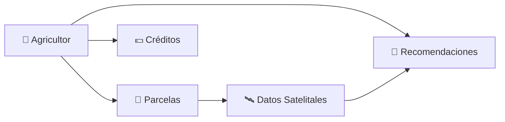

<div align="center">

# 🌾 Sembri

### Plataforma Agrícola Inteligente

*Transformando la agricultura con tecnología satelital, microfinanzas e inteligencia artificial*

<br>


<br>

[](https://sembri.vercel.app)
[](https://docs.sembri.app)
[](https://github.com/tuusuario/sembri)

<br>


</div>

---

## 📋 Tabla de Contenidos

- [✨ Características](#-características)
- [🎯 Módulos](#-módulos)
- [🏗️ Arquitectura](#️-arquitectura)
- [🗄️ Base de Datos](#️-base-de-datos)
- [⚙️ Tecnologías](#️-tecnologías)
- [🚀 Inicio Rápido](#-inicio-rápido)
- [🌍 Despliegue](#-despliegue)
- [📸 Screenshots](#-screenshots)
- [🧪 Testing](#-testing)
- [🤝 Contribuir](#-contribuir)
- [📄 Licencia](#-licencia)

---

## ✨ Características

<table>
<tr>
<td width="50%">

### 🛰️ Monitoreo Satelital
- Integración con **Sentinel Hub API**
- Análisis NDVI y NDWI en tiempo real
- Historial de datos satelitales
- Gráficos interactivos de evolución

</td>
<td width="50%">

### 💰 Microfinanzas Rurales
- Sistema completo de préstamos
- Cálculo automático de intereses
- Gestión de estados y cuotas
- Panel de historial financiero

</td>
</tr>
<tr>
<td width="50%">

### 🧠 IA y Recomendaciones
- Sugerencias personalizadas por cultivo
- Detección de anomalías
- Alertas de riego y fertilización
- Sistema de notificaciones inteligente

</td>
<td width="50%">

### 🗺️ Gestión de Parcelas
- Mapas interactivos con Leaflet
- Dibujo y edición de polígonos
- Cálculo automático de áreas
- Soporte geoespacial PostGIS

</td>
</tr>
</table>

---

## 🎯 Módulos

### 👨‍🌾 Panel del Agricultor



**Funcionalidades clave:**
- Dashboard interactivo con mapas satelitales
- Registro y visualización de parcelas georreferenciadas
- Solicitud y seguimiento de créditos agrícolas
- Recomendaciones personalizadas basadas en IA
- Historial de cultivos y cosechas

### 🧑‍💼 Panel Administrativo

**Capacidades de gestión:**
- 📊 Estadísticas y métricas del sistema
- 👥 Gestión de usuarios y roles
- ✅ Aprobación de solicitudes de crédito
- 🌱 Control de parcelas y cultivos
- 📦 Administración de insumos agrícolas

---

## 🏗️ Arquitectura

<div align="center">

```
┌─────────────────────────────────────────────────────────┐
│                     SEMBRI PLATFORM                     │
├─────────────────────────────────────────────────────────┤
│                                                         │
│  ┌──────────────┐  ┌──────────────┐  ┌──────────────┐ │
│  │   Next.js    │  │   Supabase   │  │  Sentinel    │ │
│  │   Frontend   │◄─┤   Backend    │◄─┤     Hub      │ │
│  │              │  │   + PostGIS  │  │     API      │ │
│  └──────────────┘  └──────────────┘  └──────────────┘ │
│         │                  │                  │         │
│         └──────────────────┴──────────────────┘         │
│                           │                             │
│                  ┌────────▼────────┐                    │
│                  │   🌍 Leaflet    │                    │
│                  │   Maps + Draw   │                    │
│                  └─────────────────┘                    │
└─────────────────────────────────────────────────────────┘
```

</div>

### 📁 Estructura del Proyecto

```
Sembri/
├── 📱 app/
│   ├── dashboard/
│   │   ├── plots/              # 🗺️ Gestión de parcelas
│   │   ├── loans/              # 💰 Sistema de créditos
│   │   ├── recommendations/    # 🧠 Motor de IA
│   │   └── layout.tsx          # 🎨 Layout principal
│   ├── admin/                  # 👨‍💼 Panel administrativo
│   ├── auth/                   # 🔐 Autenticación
│   ├── api/                    # 🔌 API Routes
│   └── page.tsx                # 🏠 Landing page
│
├── 🧩 components/
│   ├── MapView.tsx             # Componente Leaflet
│   ├── Sidebar.tsx             # Panel de información
│   ├── LoanDialog.tsx          # Formulario de créditos
│   └── RecommendationCard.tsx  # Tarjetas de IA
│
├── 📚 lib/
│   ├── supabaseClient.ts       # Cliente Supabase
│   ├── sentinel.ts             # API Sentinel Hub
│   └── utils.ts                # Utilidades
│
├── 🛠️ scripts/
│   └── 006_fix_rls_policies.sql
│
└── 🎨 styles/
    ├── globals.css
    └── leaflet.css
```

---

## 🗄️ Base de Datos

### Esquema Principal (Supabase + PostGIS)

<table>
<thead>
<tr>
<th>Tabla</th>
<th>Descripción</th>
<th>Características</th>
</tr>
</thead>
<tbody>
<tr>
<td><code>profiles</code></td>
<td>Usuarios del sistema</td>
<td>Roles, datos personales, autenticación</td>
</tr>
<tr>
<td><code>plots</code></td>
<td>Parcelas agrícolas</td>
<td><code>GEOGRAPHY(POLYGON)</code>, área, cultivos</td>
</tr>
<tr>
<td><code>loans</code></td>
<td>Préstamos agrícolas</td>
<td>Monto, interés, estado, cuotas</td>
</tr>
<tr>
<td><code>recommendations</code></td>
<td>Sugerencias de IA</td>
<td>Tipo, prioridad, fecha, estado</td>
</tr>
<tr>
<td><code>inputs</code></td>
<td>Insumos agrícolas</td>
<td>Categoría, precio, disponibilidad</td>
</tr>
</tbody>
</table>

### 🔒 Seguridad con RLS (Row Level Security)

```sql
-- Función segura para validar administrador
create or replace function public.is_admin(uid uuid)
returns boolean
language plpgsql
security definer
as $$
begin
  return exists(
    select 1 from public.profiles p
    where p.id = uid and p.role = 'admin'
  );
end;
$$;

-- Políticas de acceso sin recursión
create policy "select_profiles"
on public.profiles
for select
using (auth.uid() = id or public.is_admin(auth.uid()));
```

<details>
<summary>📄 Ver script SQL completo</summary>

```sql
-- Elimina políticas previas
drop policy if exists "select_profiles" on public.profiles;
drop policy if exists "insert_profiles" on public.profiles;
drop policy if exists "update_profiles" on public.profiles;
drop policy if exists "delete_profiles" on public.profiles;

-- Crea función segura para validar administrador
create or replace function public.is_admin(uid uuid)
returns boolean
language plpgsql
security definer
as $$
begin
  return exists(
    select 1 from public.profiles p
    where p.id = uid and p.role = 'admin'
  );
end;
$$;

-- Políticas nuevas seguras sin recursión
create policy "select_profiles"
on public.profiles
for select
using (
  auth.uid() = id or public.is_admin(auth.uid())
);

create policy "insert_profiles"
on public.profiles
for insert
with check (
  auth.uid() = id or public.is_admin(auth.uid())
);

create policy "update_profiles"
on public.profiles
for update
using (
  auth.uid() = id or public.is_admin(auth.uid())
)
with check (
  auth.uid() = id or public.is_admin(auth.uid())
);

create policy "delete_profiles"
on public.profiles
for delete
using (public.is_admin(auth.uid()));
```

</details>

---

## ⚙️ Tecnologías

<div align="center">

| Categoría | Stack |
|:---------:|:------|
| **Frontend** | Next.js 14, React 18, TypeScript, TailwindCSS |
| **UI Components** | Shadcn/UI, Lucide Icons, Radix UI |
| **Mapas** | Leaflet, Leaflet Draw, React-Leaflet |
| **Backend** | Supabase (PostgreSQL + Auth + Storage) |
| **Geoespacial** | PostGIS, Turf.js |
| **Satélite** | Sentinel Hub API, Sentinel-2 L2A |
| **Gráficos** | Recharts, Chart.js |
| **Testing** | Jest, React Testing Library |
| **Despliegue** | Vercel, Docker |

</div>

---

## 🚀 Inicio Rápido

### Prerrequisitos

```bash
Node.js >= 18.x
npm >= 9.x
PostgreSQL >= 14
```

### Instalación

```bash
# 1️⃣ Clonar el repositorio
git clone https://github.com/tuusuario/sembri.git
cd sembri

# 2️⃣ Instalar dependencias
npm install

# 3️⃣ Configurar variables de entorno
cp .env.example .env.local
# Edita .env.local con tus credenciales
```

### 🔐 Variables de Entorno

Crea un archivo `.env.local`:

```bash
# Supabase
NEXT_PUBLIC_SUPABASE_URL=https://<tu-proyecto>.supabase.co
NEXT_PUBLIC_SUPABASE_ANON_KEY=<tu_anon_key>
SUPABASE_SERVICE_ROLE_KEY=<tu_service_key>

# Sentinel Hub (Opcional - usa datos mock si no se configura)
SENTINEL_CLIENT_ID=<tu_client_id>
SENTINEL_CLIENT_SECRET=<tu_client_secret>
SENTINEL_INSTANCE_ID=<tu_instance_id>
```

### 🗃️ Configuración de Base de Datos

```bash
# Ejecutar migraciones SQL
psql -U postgres -d sembri < scripts/006_fix_rls_policies.sql

# O desde el panel de Supabase SQL Editor
```

### ▶️ Ejecutar en desarrollo

```bash
npm run dev
```

Abre [http://localhost:3000](http://localhost:3000) en tu navegador.

### 🏗️ Build para producción

```bash
npm run build
npm start
```

---

## 🌍 Despliegue

### Vercel (Recomendado)

[](https://vercel.com/new/clone?repository-url=https://github.com/tuusuario/sembri)

1. Conecta tu repositorio en Vercel
2. Configura las variables de entorno
3. Deploy automático en cada push

### Docker

```bash
# Build
docker build -t sembri .

# Run
docker run -p 3000:3000 --env-file .env.local sembri
```

### Otras Plataformas

✅ Compatible con Netlify, Railway, Render, AWS Amplify

---

## 📸 Screenshots

<div align="center">

### Dashboard del Agricultor


### Mapa de Parcelas


### Panel Administrativo


</div>

---

## 🧪 Testing

```bash
# Ejecutar todos los tests
npm test

# Tests con coverage
npm run test:coverage

# Tests en modo watch
npm run test:watch

# Tests E2E
npm run test:e2e
```

---

## 🤝 Contribuir

¡Las contribuciones son bienvenidas! Por favor sigue estos pasos:

1. 🍴 Fork el proyecto
2. 🌿 Crea tu rama (`git checkout -b feature/AmazingFeature`)
3. 💾 Commit tus cambios (`git commit -m 'Add: nueva característica'`)
4. 📤 Push a la rama (`git push origin feature/AmazingFeature`)
5. 🔃 Abre un Pull Request

### Convenciones de Commits

```
feat: nueva característica
fix: corrección de bug
docs: cambios en documentación
style: formato, punto y coma, etc
refactor: refactorización de código
test: añadir tests
chore: actualizar dependencias
```

---

## 🗺️ Roadmap v2.0

- [ ] 🤖 Chatbot agrícola con IA generativa
- [ ] 🌍 Soporte multilingüe (ES, EN, K'iche')
- [ ] 📱 App móvil (React Native)
- [ ] 🐛 Detección de plagas con visión por computadora
- [ ] 🌦️ Predicción meteorológica integrada
- [ ] 📊 Dashboard de analytics avanzado
- [ ] 🔔 Sistema de notificaciones push
- [ ] 💳 Integración con pasarelas de pago

---

## 👥 Equipo

<div align="center">

**Autor Principal**  
Jose Medina  
[GitHub](https://github.com/tuusuario) • [LinkedIn](https://linkedin.com/in/tuusuario)

**Organización**  
La Candona

</div>

---

## 📄 Licencia

Este proyecto está bajo la Licencia MIT. Ver el archivo [LICENSE](LICENSE) para más detalles.

---

## 🙏 Agradecimientos

- [Sentinel Hub](https://www.sentinel-hub.com/) - Imágenes satelitales
- [Supabase](https://supabase.com/) - Backend as a Service
- [Leaflet](https://leafletjs.com/) - Mapas interactivos
- [Vercel](https://vercel.com/) - Hosting y deployment

---

<div align="center">

### 💚 Hecho con amor para la agricultura sostenible

**"La agricultura del futuro será digital, sostenible e inclusiva."** 🌱

<br>

[](https://github.com/tuusuario/sembri)
[](https://github.com/tuusuario)

</div>
